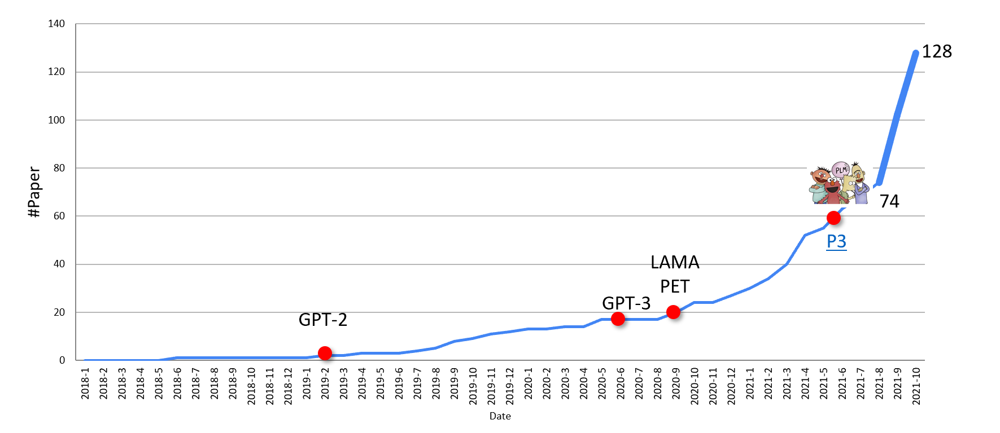

# 简介

prompt在自2021年大模型的兴起之后，逐渐得到了广泛的关注和研究.Pre-train, Prompt, and Predict在刘鹏飞的关于NLP prompt综述[^1]内甚至被成为NLP的第四范式。随着大模型的不断进展，针对大模型的prompt的研究也在不断地深入。

prompt类似于fine-tune，他们的共同目标都是使得预训练模型和下游任务（在CV方向就是目标检测、图像生成等）尽可能地相近。回忆起在fine-tune预训练模型地做法，我们往往在一个已经在ImageNet-1k上的得到验证的模型backbone，如果想要使用这个模型来做目标检测，我们需要在backbone上添加一个RPN网络，然后再添加一个ROIHead，最后再添加一个分类器，然后对这个backbone做一些`loss func`、`optimizer`的修改，引入下游任务的一些先验的信息（如目标检测就引入一些检测框的位置信息）。在进行fine-tune时候，一般不会对输入数据做任何的修改，我们只希望backbone模型通过训练，能够蕴含更多的下游任务的信息。

而prompt则刚好相反，关于prompt的工作则大部分集中于对于输入数据的修改，prompt通过在数据的输入和输出进行修改，使得下游任务的输入和输出更加靠近backbone，而不是使得backbone具备更多下游信息的知识。因此，使用prompt有一个必要的前提条件，使用prompt的模型必须已经具备了十分丰富的相关知识，使得我们能够接受修改下游任务的输入和输出来匹配模型。

借用综述[^1]对于prompt的定义：
    1. 我们需要定义一个函数 $f_{prompt}$，将下游任务数据输入$x$改造为backbone的输入$x'$,也被称为Prompt Engineering。
    2. 选取合适的模型backbone,并将$x'$输入backbone得到输出$y$,。
    3. 定义一个函数$g_{prompt}$，将backbone的输出$y$改造为下游任务的输出$y'$,也被称为Answer Engineering。
   
针对prompt的研究主要集中在一下几个方向：
- 选取模型，选择合适的模型进行prompt，例如GPT、BERT、UniLM等模型，这些模型都具备很大的参数量，并且已经在海量的数据集上充分进行了训练
- 如何定义$f_{prompt}$和$g_{prompt}$，这两个函数的定义直接决定了prompt的效果，也是prompt的核心。目前大部分的研究工作都在寻找一个合适的$f_{prompt}$和$g_{prompt}$.这个方向的研究具有着一下趋势：从hand-craft到automatic，从single-prompt到multi-prompt.

## 参考文献

[^1]:《Pre-train, Prompt, and Predict: A Systematic Survey of Prompting Methods in Natural Language Processing》